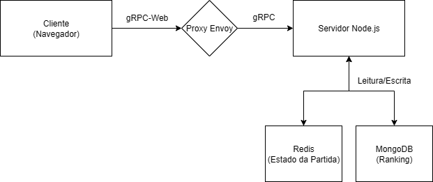

## Tetris Multijogador Distribuído

Bem-vindo ao projeto Tetris Multijogador Distribuído, desenvolvido como parte da disciplina de Sistemas Distribuídos. Este projeto implementa uma versão multiplayer do clássico jogo Tetris, com comunicação em tempo real entre clientes e um servidor central, utilizando tecnologias modernas e escaláveis.

## Arquitetura

A arquitetura do sistema segue o modelo cliente-servidor distribuído, com comunicação em tempo real otimizada para baixa latência.



### Componentes:


-  Clientes Web (HTML5 + JS): Responsáveis pela interface gráfica (renderizada com a Canvas API) e pela captura da interação do jogador.
-  Servidor Central (Node.js): Orquestra as partidas, gere o estado do jogo em tempo real, processa a lógica de negócio e gere a persistência dos dados.
-  Proxy (Envoy): Atua como um intermediário que traduz os pedidos gRPC-Web (baseados em HTTP/1.1) do navegador para o protocolo gRPC padrão (baseado em HTTP/2) que o servidor Node.js entende.
-  gRPC + Protobuf: Define e executa a comunicação entre clientes e servidor de forma eficiente e com um contrato de serviço bem definido.
-  Redis: Utilizado como uma base de dados em memória de alta velocidade para armazenar estados temporários, como o estado de uma partida em andamento e a fila de matchmaking.
-  MongoDB: Base de dados NoSQL utilizada para armazenamento de longo prazo, como o histórico de partidas e o ranking global dos jogadores.

## Tecnologias Utilizadas

-  HTML5 + JS: Interface gráfica do jogo e controlo de entrada do utilizador.
-  Canvas API: Renderização gráfica 2D do tabuleiro e das peças do Tetris.
-  Node.js: Plataforma para o servidor assíncrono central do jogo.
-  gRPC: Protocolo RPC (Remote Procedure Call) eficiente para a comunicação.
-  Protocol Buffers: Linguagem para definir o contrato de serviço e as mensagens trocadas.
-  Redis: Armazenamento rápido e temporário do estado das partidas ativas.
-  MongoDB: Banco de dados NoSQL para persistir rankings e histórico de jogos.
-  Docker: Plataforma para gerem contentores. ir e executar as bases de dados (Redis, MongoDB)

## Interface do Serviço (gRPC)

O contrato de serviço, definido em tetris.proto, expõe as seguintes operações
principais:

```
JoinGame(Player) returns (stream GameState)
```
-  Cliente solicita a entrada numa partida. O servidor adiciona o jogador a uma fila de matchmaking e, quando um par é formado, retorna um stream (fluxo contínuo) com as atualizações do estado do jogo.

```
SendAction(PlayerAction) returns (Empty)
```
-  Cliente envia uma ação para o servidor (ex: mover peça para a esquerda, rodar). A resposta a esta ação é enviada de volta através do stream do JoinGame.

```
GetRanking(Empty) returns (RankingResponse)
```
-  Recupera a tabela de classificação com os melhores jogadores.

## Design para Robustez e Tolerância a Falhas

Para garantir uma maior robustez, a arquitetura foi desenhada com os seguintes mecanismos em mente:


-  Reconexão de Cliente: Cada jogador recebe um player_id único. Caso a conexão caia, o cliente pode tentar reconectar-se à partida em andamento usando este mesmo ID, recuperando o estado do jogo que está armazenado no Redis.
-  Estado Centralizado no Redis: Ao manter o estado da partida no Redis (com um TTL + Time To Live ), o servidor Node.js torna-se stateless. Isto significa que, caso uma instância do servidor falhe, outra pode assumir a gestão da partida sem perda de dados, desde que a partida ainda esteja no cache do Redis.
-  Heartbeat: Um mecanismo de heartbeat poderia ser implementado para que o servidor detete ativamente desconexões de clientes, permitindo limpar recursos e notificar o oponente mais rapidamente.

## Como Executar o Projeto

### Pré-requisitos

-  Docker e Docker Compose
-  Node.js e Yarn (ou NPM)
-  Compilador protoc e plugin protoc-gen-grpc-web instalados e no PATH do sistema.

### Iniciar as Bases de Dados

Na raiz do projeto, inicie os contentores do Redis e MongoDB.

```
docker-compose up -d
```
### Configurar e Executar o Servidor

```
# Navegue até à pasta do servidor
cd server

# Instalar dependências
yarn install

# Gerar o código gRPC a partir do ficheiro .proto
# Este comando gera os ficheiros JS para o servidor Node.js
protoc -I=./proto --grpc_out=grpc_js:./src --js_out=import_style=commonjs:./src ./proto/tetris.proto

# Em Windows.
npx protoc --proto_path=./proto --js_out=import_style=browser,binary:../client/proto --grpc-web_out=import_style=typescript,mode=grpcwebtext:../client/proto ./proto/tetris.proto

# Iniciar o servidor (recomenda-se usar um ficheiro .env para as variáveis)
yarn start
```
### Configurar e Executar o Cliente

O cliente requer um proxy Envoy) para comunicar com o servidor gRPC e um
servidor web para servir os ficheiros estáticos.

```
# A partir da raiz do projeto, gere o código gRPC-Web para o cliente
protoc -I=./server/proto --js_out=import_style=commonjs,binary:./client/proto --grpc-web_out=import_style=commonjs,mode=grpcwebtext:./client/proto ./server/proto/tetris.proto

# Inicie o proxy Envoy (ver ficheiro de configuração envoy.yaml)
docker run -d --name=envoy -p 8080:8080 -v $(pwd)/envoy.yaml:/etc/envoy/envoy.yaml envoyproxy/envoy:v1.22.0

# Em Windows
docker run -d --rm --name=envoy -p 8080:8080 --network=tetris-sd_tetris-net -v ${pwd}/envoy.yaml:/etc/envoy/envoy.yaml envoyproxy/envoy:v1.22.0

# Navegue até à pasta do cliente e sirva os ficheiros
cd client
npm install -g http-server
http-server . -p 8081
```

Abra [http://localhost:8081](http://localhost:8081) num navegador moderno.

## Ranking e Dados Persistentes

Rankings e partidas finalizadas são armazenados numa coleção MongoDB com a
seguinte estrutura:

```
{
    "gameId": "a1b2-c3d4-e5f6",
    "players": [
        { "name": "Joao", "score" 3200 ,
        { "name": "Maria", "score" 2850 
    ],
    "winnerName": "Joao",
    "durationSeconds": 185,
    "createdAt": "2025-07-05T15:00:00Z"
}
```
## Possíveis Expansões Futuras

-  Autenticação de utilizadores com JWT.
-  Matchmaking baseado em habilidade (ELO rating).
-  Salas públicas e privadas com convites.
-  Chat em tempo real entre jogadores na partida.
-  Modos de jogo alternativos.


## Colaboradores

-    [Pedro Henrique Gradella](https://github.com/unbigou)


